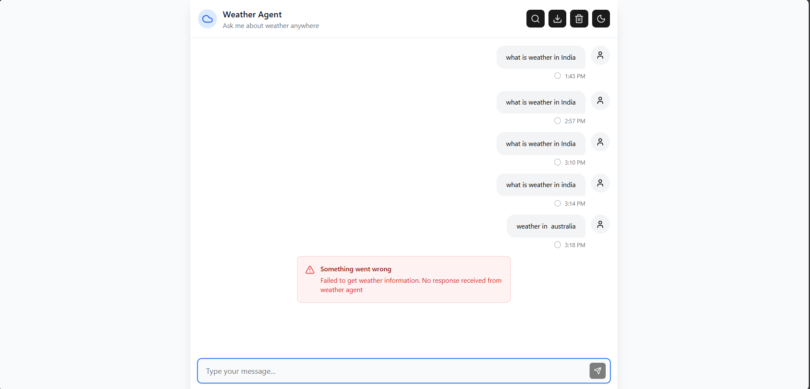
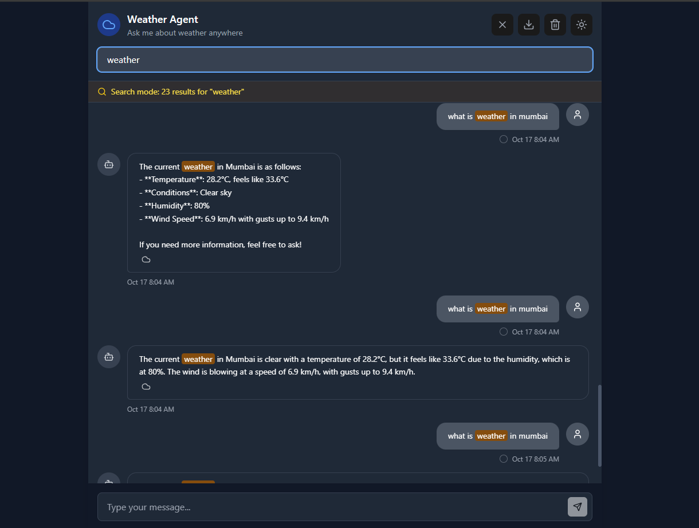

````markdown
# 🌦️ Weather Agent Chat Interface

A **responsive chat interface** for interacting with a weather agent API, built with **React, Vite, and Tailwind CSS**.

---

## 🚀 Features
- 💬 Chat-style interface for weather queries  
- 🌙 Dark/Light theme toggle  
- 🔍 Search through message history  
- 🗑️ Clear chat history  
- 📥 Export chat history as a file  
- ⚡ Built with React + Vite for fast performance  
- 🎨 Styled using Tailwind CSS  

---

## 📋 Prerequisites
Before you begin, make sure you have the following installed:

- [Node.js](https://nodejs.org/) (version **16 or higher**)  
- npm (comes with Node.js)

---

## 🛠️ Setup Instructions

### 1️⃣ Install Dependencies
```bash
npm install
````

### 2️⃣ Configure API

Open **`src/hooks/useWeatherApi.js`**
Find **line 22**:

```js
threadId: "YOUR_COLLEGE_ROLL_NUMBER"
```

Replace `"YOUR_COLLEGE_ROLL_NUMBER"` with your **actual college roll number**.

### 3️⃣ Start Development Server

```bash
npm run dev
```

The app will start at:
👉 [http://localhost:3000](http://localhost:3000)

### 4️⃣ Test the Application

* Type a weather question like:

  ```
  What's the weather in London?
  ```
* Press **Enter** or click **Send**
* Wait for the weather agent to respond

---

## 📜 Available Scripts

| Command           | Description              |
| ----------------- | ------------------------ |
| `npm run dev`     | Start development server |
| `npm run build`   | Build app for production |
| `npm run preview` | Preview production build |
| `npm run lint`    | Lint project files       |

---

## 📱 Usage

* ⌨️ Type your weather questions in the input field
* ↩️ **Enter** to send | **Shift + Enter** for new line
* 🔍 Click the **search icon** to filter chat history
* 🌙 Click the **moon/sun icon** to toggle themes
* 📥 Click the **download icon** to export chat
* 🗑️ Click the **trash icon** to clear messages

## 📸 Screenshots

### WeatherApp


### WeatherApp

